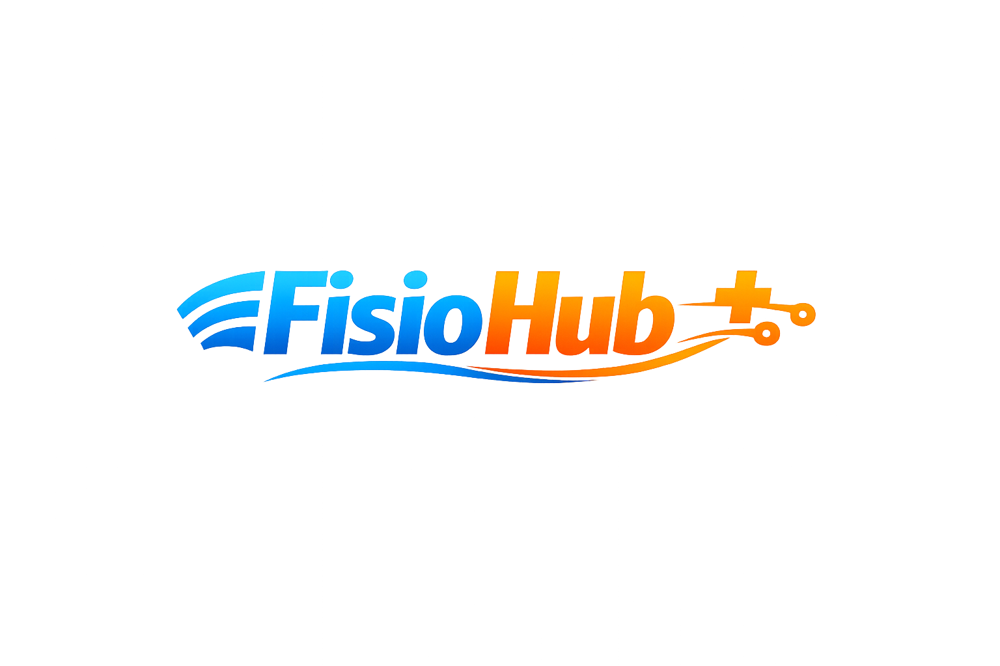

<h1 align="center">
   FisioHub
</h1>

<p align="center">
  <strong>Gestão local, visual e organizada para a Clínica de Fisioterapia ESEFID/UFRGS.</strong>
</p>

<p align="center">
  
  
  
  
</p>

---

## O que você encontrará aqui

- [Conheça o Projeto](#conheça-o-projeto)
- [O que o sistema faz](#o-que-o-sistema-faz)
- [Módulos do FisioHub](#módulos-do-fisiohub)
- [Extensões de apoio](#extensões-de-apoio)
- [Guia rápido de uso](#guia-rápido-de-uso)
- [Servidor interno de testes](#servidor-interno-de-testes)
- [Validação técnica](#validação-técnica)
- [Segurança e backups](#segurança-e-backups)
- [GitHub Pages](#github-pages)
- [Smoke test manual](#smoke-test-manual)
- [Termos de uso e suporte](#termos-de-uso-e-suporte)

---

## Conheça o Projeto

O **FisioHub** é um sistema local para organizar dados operacionais da Clínica de Fisioterapia ESEFID/UFRGS. Ele centraliza importação, processamento, conferência e consulta de informações do atendimento em uma interface escura, responsiva e pensada para uso diário.

### Para quem foi feito?

Foi desenvolvido para uso interno da **ESEFID/UFRGS - Clínica de Fisioterapia**, com foco em facilitar a rotina de conferência de atendimentos, pendências, pacientes, agenda e financeiro.

### Por que ele ajuda?

- **Economiza tempo:** transforma arquivos de coleta em dados organizados.
- **Organiza a rotina:** separa informações em módulos claros.
- **Funciona localmente:** os dados ficam no navegador do computador usado.
- **Evita retrabalho:** reaproveita histórico de pacientes e ajuda a preencher informações obrigatórias.
- **É compatível com GitHub Pages:** funciona como SPA com rotas por hash.

---

## O que o sistema faz

### Importação e processamento

O FisioHub recebe dados coletados do ZenFisio, permite edição direta no bloco de notas interno e processa tudo para gerar uma base local consolidada.

### Organização por data

Você escolhe uma data de referência e o sistema usa essa data para filtrar, conferir e apresentar os dados nos módulos.

### Correções assistidas

Quando faltam informações importantes, como convênio ou procedimento, o sistema abre fluxos de correção para evitar processamento incompleto.

### Análise consolidada

O sistema possui uma área de análise para cruzar dados de evoluções, financeiro e agendamentos, com saída pronta para consulta, texto ou impressão.

---

## Módulos do FisioHub

### Evoluções Pendentes

Ajuda a identificar pacientes atendidos que ainda precisam de evolução registrada.

- Lista pendências por data.
- Permite marcar evolução como concluída.
- Ajuda a acompanhar o que ainda precisa ser revisado.

### Análise Financeira

Organiza valores, convênios e procedimentos para facilitar a leitura financeira.

- Mostra totais e agrupamentos.
- Ajuda a conferir atendimentos particulares e convênios.
- Gera uma visão consolidada para análise.

### Agendamentos

Apresenta os agendamentos processados de forma organizada.

- Mostra dados por data de referência.
- Ajuda a conferir comparecimentos, faltas e status.
- Facilita revisão da agenda processada.

### Lista de Pacientes

Cria e mantém uma base local de pacientes.

- Armazena contato, convênio e histórico.
- Permite abrir detalhes do paciente.
- Mantém dados úteis para reaproveitamento em novos processamentos.

### Registro de Paciente

Exibe a ficha/histórico individual de um paciente selecionado.

- Mostra informações consolidadas.
- Ajuda a consultar atendimentos anteriores.
- Facilita revisão de dados do paciente.

### Análise consolidada

Painel executivo acessível pelo botão `Análise` no rodapé.

- Cruza evoluções, financeiro e agendamentos da data de referência.
- Gera panorama institucional para consulta rápida.
- Permite exportar em TXT ou imprimir em A4.

---

## Extensões de apoio

O FisioHub principal funciona sem depender das extensões, mas elas ajudam no fluxo com o ZenFisio.

### `zenfisio-ColetorDeDados`

Extensão Chrome para coletar dados da agenda do ZenFisio.

Principais recursos:

- Atalho `Ctrl + Shift + X`.
- Coleta manual ou automática dos blocos visíveis da agenda.
- Salvamento em TXT com data da agenda no formato `dd.mm.yy`.
- Lembra o último local usado no seletor de arquivo.
- Painel compacto com salvar, limpar, iniciar/desativar e coletar automaticamente.

### `zenfisio-NotificarMensagens`

Extensão Chrome para auxiliar notificações no Google Chat.

Principais recursos:

- Atalho `Ctrl + Shift + Z`.
- Monitoramento de status no ZenFisio.
- Histórico de mensagens enviadas.
- Ações rápidas para abrir ZenFisio, Chat, histórico e teste de chat.
- Suporte a status como atendido, cancelado e faltou.

### `zenfisio-AlertaRepetidor`

Extensão Chrome para identificar agendamentos com repetição completa que precisam renovar.

Principais recursos:

- Análise automática por clique sequencial na agenda do ZenFisio (07h a 17h).
- Destaca cards com `Repetido: X de Y` quando `X === Y` e total entre 1 e 20.
- Faixa branca animada no card para facilitar a visualização.
- Botão flutuante `AR` com menu para iniciar ou parar a análise.
- Atalho `Alt + Z` para mostrar ou ocultar o botão flutuante.
- Destaques persistem ao abrir/fechar agendamentos, recarregar a página e durante o mesmo dia.

---

## Guia rápido de uso

### 1. Coletar dados no ZenFisio

Use a extensão `zenfisio-ColetorDeDados` no site do ZenFisio:

- Aperte `Ctrl + Shift + X`.
- Clique em `Iniciar`.
- Use `Coletar auto` para coletar os agendamentos visíveis entre 08h e 17h, ou colete manualmente.
- Clique em `Salvar TXT`.

### 1.1. (Opcional) Conferir renovações na agenda

Use a extensão `zenfisio-AlertaRepetidor` no calendário do ZenFisio:

- Aperte `Alt + Z` para exibir o botão flutuante `AR`, se necessário.
- Clique em `Iniciar analise` no menu ou no popup da extensão.
- Aguarde a varredura automática dos agendamentos entre 07h e 17h.
- Cards com repetição completa (ex.: `3 de 3`) recebem destaque animado.
- Use `Parar analise` para interromper sem perder os destaques já encontrados.

### 2. Abrir o FisioHub

Abra o sistema local ou a versão publicada no GitHub Pages.

Rota principal:

```text
index.html#/home
```

### 3. Selecionar a data

Na tela inicial, escolha a data de referência. Essa data será usada para conferir e processar os dados importados.

### 4. Importar e processar

- Clique em `Importar dados`.
- Se necessário, edite o texto importado diretamente no bloco.
- Clique em `Processar`.
- Resolva correções solicitadas pelo sistema, quando aparecerem.

### 5. Conferir módulos

Depois do processamento, navegue por:

- `Evoluções Pendentes`
- `Análise Financeira`
- `Agendamentos`
- `Lista de Pacientes`

Use o botão `Análise` no rodapé para abrir o painel consolidado da data selecionada.

---

## Servidor interno de testes

Para testar localmente, use o arquivo criado na raiz:

```powershell
abrir-servidor-interno.bat
```

Ele instala dependências se necessário e abre o servidor em:

```text
http://127.0.0.1:4173/index.html#/home
```

Também é possível rodar manualmente:

```powershell
npm install
npm run dev
```

---

## Validação técnica

Comandos principais:

```powershell
npm run check
npm run test
npm run check:extension
npm run check:repeat-alert
```

O que cada comando faz:

- `npm run check`: valida TypeScript e build do app principal.
- `npm run test`: roda build e testes automatizados do app e do Coletor.
- `npm run check:extension`: valida, testa e compila a extensão `zenfisio-NotificarMensagens`.
- `npm run check:repeat-alert`: valida, testa e compila a extensão `zenfisio-AlertaRepetidor`.

Build individual das extensões:

```powershell
npm --prefix zenfisio-NotificarMensagens run build
npm --prefix zenfisio-AlertaRepetidor run build
```

A extensão `zenfisio-ColetorDeDados` não usa build separado; carregue a pasta diretamente no Chrome.

---

## Segurança e backups

### Dados locais

O FisioHub armazena dados no navegador, usando armazenamento local. Nenhum dado clínico é enviado para servidores externos pelo sistema principal.

### Backups

Use o botão `Backups` para:

- Exportar backup completo.
- Exportar somente pacientes.
- Exportar dados sem pacientes.
- Importar backups em outro navegador/computador.

### Cuidados importantes

- Faça backup antes de grandes limpezas.
- Confira a data antes de processar.
- Revise conflitos de pacientes com nomes parecidos.
- Use `Limpar Tudo` apenas quando quiser reiniciar os dados locais.

---

## GitHub Pages

O FisioHub foi organizado para funcionar com GitHub Pages.

Regras importantes:

- `index.html` permanece na raiz.
- A aplicação usa rotas por hash, como `index.html#/pacientes`.
- Assets ficam em `assets/images`.
- HTML, CSS, TypeScript e JavaScript compilado ficam em pastas separadas.

Antes de publicar:

```powershell
npm run check
npm run test
npm run check:extension
npm run check:repeat-alert
```

---

## Smoke test manual

Antes de entregar uma nova versão:

- Abrir `index.html#/home` e conferir título, rodapé e versão.
- Testar botão `Tutorial`.
- Navegar para todos os módulos.
- Importar um arquivo pequeno e processar.
- Conferir pacientes, evoluções, agendamentos e financeiro.
- Testar backup/exportação e importação.
- Abrir o painel `Análise` no rodapé e conferir TXT/impressão.
- Recarregar as três extensões no Chrome e conferir versão `0.5.7` nos manifests.
- No ZenFisio, testar `zenfisio-AlertaRepetidor`: iniciar análise, parar no meio, abrir/fechar agendamento e recarregar a página no mesmo dia.

---

## Termos de uso e suporte

Este sistema é fornecido para uso interno da ESEFID/UFRGS - Clínica de Fisioterapia, com foco em colaboração profissional, organização de processos e segurança local dos dados.

### Direitos do desenvolvedor

O desenvolvedor **Necromante96Official (Lucas Tavares)** mantém:

- Propriedade intelectual do código e da arquitetura.
- Direito de manter o projeto em portfólio profissional.
- Direito de evoluir, ajustar e documentar o sistema.

### Direitos da instituição

A clínica pode:

- Usar o sistema em sua rotina interna.
- Gerenciar dados locais e backups.
- Solicitar ajustes e melhorias conforme necessidade operacional.

### Restrições

Não é permitido:

- Compartilhar o sistema com terceiros sem autorização.
- Comercializar o projeto.
- Remover créditos do desenvolvedor.
- Usar o código como base para produto comercial próprio sem permissão.

### Suporte

O suporte inclui:

- Correção de erros críticos.
- Ajustes técnicos.
- Melhorias combinadas com a operação.
- Orientação de uso dentro do escopo do projeto.

O suporte não inclui atendimento 24/7, treinamento formal individual ou recuperação de arquivos apagados pelo usuário.

---

<p align="center">
  <strong>© 2026 Necromante96Official • Todos os direitos reservados</strong><br>
  Criado por <a href="https://github.com/Necromante96Official">Lucas Tavares</a> para apoiar a rotina da Clínica de Fisioterapia ESEFID/UFRGS.<br>
  <em>FisioHub 0.5.7 - versão local, modular e compatível com GitHub Pages.</em>
</p>
